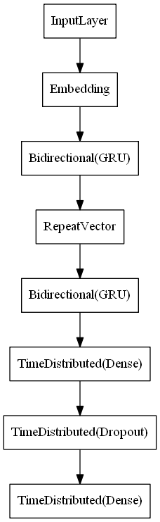

# Udacity Natural Language Processing Nanodegree

## Machine Translation

Final RNN Model            |
:-------------------------:|
|

This project implements a recurrent neural network that functions as part of an end-to-end machine translation pipeline. It accepts English text as input and returns the French translation.


### Requirements

1. Download and install [Git](https://git-scm.com)
2. Download and install [Anaconda](https://www.anaconda.com)

### Set-up

Clone the project repository
```
git clone https://github.com/sdonatti/nd892-project-machine-translation
```

Install required Python packages
```
cd nd892-project-machine-translation
conda env create -f environment.yaml
conda activate nd892-project-machine-translation
```

Launch the project Jupyter Notebooks
```
jupyter notebook
```

### License

This project is licensed under the [MIT License](LICENSE)